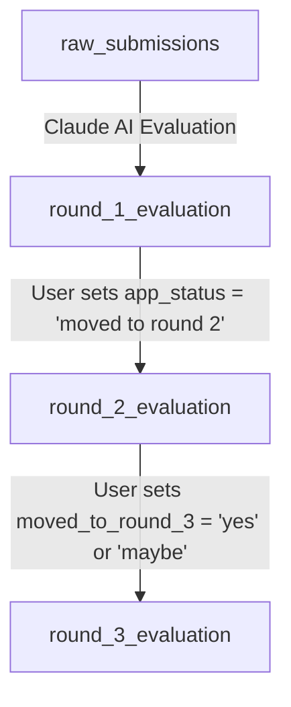

# Recruiting Agent Internal Database Architecture

This document defines the schema design and architecture for the recruiting agent. The database runs on **Supabase (PostgreSQL)** and manages candidate states across the entire funnel.

---

## 1. Funnel Architecture Overview

The candidate evaluation pipeline consists of 4 distinct tables representing stages of the recruitment funnel:

---

## 2. Table Schemas & Column Specifications

### A. Raw Submissions Table (`raw_submissions`)
This table holds the raw application details ingested from the Google Forms / intake spreadsheet.
- **Primary Key**: `id`
- **Control Column**: `Analysis_status` (VARCHAR(100)) to flag if Claude has evaluated this candidate.

| Column Name | PostgreSQL Type | Nullable | Description / Example Values |
| :--- | :--- | :--- | :--- |
| `id` | BIGINT | NO (PK) | Unique candidate submission ID (e.g. 37) |
| `submission_date` | TIMESTAMP WITH TIME ZONE | YES | Date and time of application submission |
| `full_name` | VARCHAR(255) | NO | Candidate's full name |
| `email` | VARCHAR(255) | YES | Contact email address |
| `phone` | VARCHAR(50) | YES | Contact phone number |
| `linkedin` | TEXT | YES | LinkedIn profile URL |
| `location` | VARCHAR(255) | YES | Current location / City |
| `preferred_start_date`| DATE | YES | Candidate's available start date |
| `education_level` | VARCHAR(100) | YES | UG/PG/Other status (e.g. "B.Tech", "M.Tech") |
| `ug_university` | VARCHAR(255) | YES | Undergraduate college/university name |
| `masters_university` | VARCHAR(255) | YES | Master's college/university name (if any) |
| `course_major` | VARCHAR(255) | YES | Major stream (e.g. "Computer Science") |
| `degree_status` | VARCHAR(50) | YES | "Graduated", "Ongoing", etc. |
| `completion_year` | INT | YES | Year of graduation (e.g. 2025) |
| `programming_languages`| TEXT | YES | Self-reported programming languages (comma-separated) |
| `aiml_experience` | VARCHAR(100) | YES | Self-reported AI/ML experience duration |
| `claude_ecosystem` | VARCHAR(100) | YES | Claude ecosystem tier rating |
| `skill_python` | INT | YES | Python skill rating (1-5) |
| `skill_deep_learning` | INT | YES | Deep Learning skill rating (1-5) |
| `skill_nlp` | INT | YES | NLP skill rating (1-5) |
| `skill_computer_vision`| INT | YES | Computer Vision skill rating (1-5) |
| `skill_reinforcement_learning`| INT | YES | Reinforcement Learning skill rating (1-5) |
| `skill_multimodal_ai` | INT | YES | Multimodal AI skill rating (1-5) |
| `skill_finetuning_lora_peft`| INT | YES | LoRA/PEFT finetuning skill rating (1-5) |
| `skill_llm_orchestration`| INT | YES | LLM Orchestration skill rating (1-5) |
| `skill_agent_fundamentals`| INT | YES | Agent Fundamentals skill rating (1-5) |
| `skill_mcp` | INT | YES | Model Context Protocol (MCP) skill rating (1-5) |
| `skill_embeddings_vector_rag`| INT | YES | Embeddings/RAG skill rating (1-5) |
| `skill_reasoning_models`| INT | YES | Reasoning models skill rating (1-5) |
| `skill_evals` | INT | YES | Evaluation frameworks skill rating (1-5) |
| `skill_ai_coding_tools`| INT | YES | AI Coding Tools usage rating (1-5) |
| `skill_rag` | INT | YES | Generic RAG skill rating (1-5) |
| `current_project` | TEXT | YES | Project details / explanation by applicant |
| `project_state` | VARCHAR(100) | YES | Project deployment state (e.g., "In staging") |
| `project_category` | VARCHAR(100) | YES | Project category classification |
| `demo_link` | TEXT | YES | Project demo URL |
| `github_url` | TEXT | YES | GitHub codebase repository URL |
| `preferred_industry` | VARCHAR(255) | YES | Industry preference |
| `open_to_onsite` | VARCHAR(100) | YES | Onsite work willingness (Yes/No/Negotiable) |
| `open_to_travel` | VARCHAR(100) | YES | International/domestic travel willingness |
| `anything_else` | TEXT | YES | Additional details or open notes |
| `applied_role` | VARCHAR(255) | YES | Applied position title |
| `job_id` | VARCHAR(50) | YES | Job identifier |
| `rubric_id` | VARCHAR(50) | YES | Rubric version/id |
| `screening_type` | VARCHAR(100) | YES | Screening strategy type |
| `resume_drive_url` | TEXT | YES | Google Drive link to Resume PDF |
| `resume_filename` | VARCHAR(255) | YES | Stored filename of the resume |
| `Analysis_status` | VARCHAR(100) | YES | Internal flag: e.g. `'Completed'` once evaluated by Claude |

---

### B. Round 1 Evaluation Table (`round_1_evaluation`)
This table holds the auto-calculated rubric scores, Claude's notes, and the user's first-round action choices.
- **Primary Key**: `id` (Foreign Key referencing `raw_submissions.id`)

| Column Name | PostgreSQL Type | Nullable | Description / Constraints |
| :--- | :--- | :--- | :--- |
| `id` | BIGINT | NO (PK/FK)| Links directly to `raw_submissions.id` |
| `gender` | VARCHAR(50) | YES | Candidate gender |
| `cat` | VARCHAR(50) | YES | Category classification (e.g. UG, PG) |
| `graduation` | VARCHAR(50) | YES | Graduation status / year |
| `tier` | VARCHAR(20) | YES | Programmatic tier classification (T1, T1+, T2, T2+, T3, T4) |
| `total` | NUMERIC(4, 2) | YES | Total score out of 21 |
| `edu` | NUMERIC(3, 2) | YES | Calculated Education score (Max 5) |
| `exp` | NUMERIC(3, 2) | YES | Calculated Experience score (Max 5) |
| `proj` | NUMERIC(3, 2) | YES | Calculated Projects score (Max 5) |
| `substance` | NUMERIC(3, 2) | YES | Substance evaluation component score |
| `deploy` | NUMERIC(3, 2) | YES | Deployment evaluation component score |
| `artifact` | NUMERIC(3, 2) | YES | Artifact completeness score (Max 2) |
| `skills` | NUMERIC(3, 2) | YES | Calculated Skills score (Max 4) |
| `domain` | VARCHAR(255) | YES | Candidate domain classification |
| `degree` | VARCHAR(100) | YES | Normalized candidate degree |
| `stream` | VARCHAR(255) | YES | Candidate academic major / stream |
| `college` | VARCHAR(255) | YES | Candidate's undergraduate/masters college |
| `location` | VARCHAR(255) | YES | Candidate location |
| `ai_proj` | NUMERIC(3, 2) | YES | AI Project score |
| `fs_proj` | NUMERIC(3, 2) | YES | Fullstack Project score |
| `intern_mo` | NUMERIC(3, 2) | YES | Internship months rating |
| `co_tier` | NUMERIC(3, 2) | YES | Company Tier rating |
| `deploy_stage` | VARCHAR(100) | YES | Project deployment stage description |
| `num_skills` | INT | YES | Number of skills candidate possessed |
| `claude_lvl` | VARCHAR(100) | YES | Claude tool experience level rating |
| `aiml_exp` | VARCHAR(100) | YES | Core AI/ML experience scoring component description |
| `demo_explanation` | TEXT | YES | Copy / Extract of the applicant's project explanation |
| `demo_review_notes_ai`| TEXT | YES | Detailed review comments and color tags generated by Claude |
| `mg_review` | TEXT | YES | Manual reviewer notes (optional audit fields) |
| `mg_interview_priority`| VARCHAR(50)| YES | Manual reviewer prioritization |
| `review_comments` | TEXT | YES | **Manual Input**: Free text recruiter review comments |
| `app_status` | VARCHAR(50) | YES | **Manual Input**: `'action pending on student'`, `'moved to round 2'`, `'rejected'`, or `NULL`/`''` |
| `eval_group` | VARCHAR(100) | YES | **Manual Input**: Group name (one of 6 decided groups) |

---

### C. Round 2 Evaluation Table (`round_2_evaluation`)
This table holds deeper vetting metrics manually filled in by the recruiter for candidates advancing from Round 1.
- **Primary Key**: `id` (Foreign Key referencing `raw_submissions.id`)

| Column Name | PostgreSQL Type | Nullable | Description / Constraints |
| :--- | :--- | :--- | :--- |
| `id` | BIGINT | NO (PK/FK)| Links directly to `raw_submissions.id` |
| `when_can_they_start`| VARCHAR(50) | YES | Recruiter-entered start availability (Date format or text: `DD-MM-YYYY`) |
| `duration_months` | VARCHAR(100) | YES | Expected duration the candidate can join (e.g. "6 months") |
| `demo_review_comment`| TEXT | YES | Detailed technical feedback about the live project demo |
| `product_depth` | TEXT | YES | Recruiter notes assessing the depth of the build |
| `complexity` | VARCHAR(20) | YES | Project complexity verdict: `'High'`, `'Medium'`, `'Low'` |
| `tech_stack` | TEXT | YES | Tech stack observed during demo (e.g., "Next.js, FastAPI, PostgreSQL") |
| `solves_business_problem`| VARCHAR(10) | YES | Whether the demo solves a real business problem: `'Yes'`, `'No'` |
| `moved_to_round_3` | VARCHAR(15) | YES | **Action Selector**: `'Yes'`, `'No'`, `'Maybe'` |

---

### D. Round 3 Evaluation Table (`round_3_evaluation`)
This table manages the final stage of interviewing, verdict logging, and hiring outcomes.
- **Primary Key**: `id` (Foreign Key referencing `raw_submissions.id`)

| Column Name | PostgreSQL Type | Nullable | Description / Constraints |
| :--- | :--- | :--- | :--- |
| `id` | BIGINT | NO (PK/FK)| Links directly to `raw_submissions.id` |
| `review_comments` | TEXT | YES | Final interview notes and feedback |
| `verdict` | VARCHAR(10) | YES | Final hiring verdict: `'Yes'`, `'No'`, or `NULL`/`''` (Pending) |
